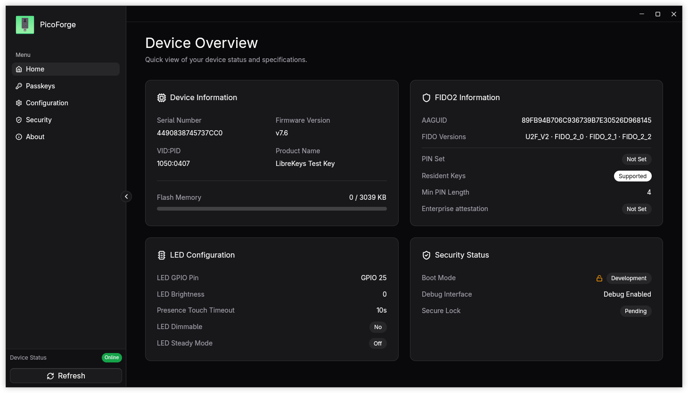
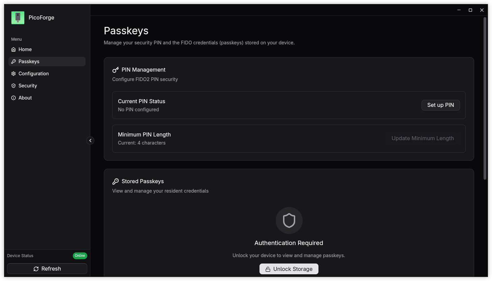
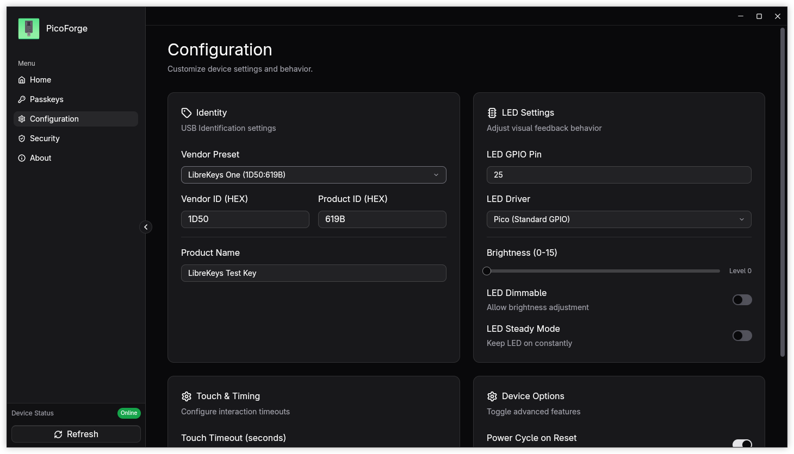

<div align="center">

# PicoForge


**An open source commissioning tool for Pico FIDO security keys**

[](https://www.gnu.org/licenses/agpl-3.0)
[](https://github.com/librekeys/picoforge/issues)

[](https://copr.fedorainfracloud.org/coprs/lockedmutex/picoforge/package/picoforge/)
[](https://github.com/librekeys/picoforge/stargazers)

</div>

> [!IMPORTANT]
> PicoForge is an independent, community-developed tool and is not affiliated with or endorsed by the official [pico-fido](https://github.com/polhenarejos/pico-fido) project. 
> This software does not share any code with the official closed-source pico-fido application.
>
> **BETA Status**: This application is currently under active development and in beta stage. Users should expect bugs and are encouraged to report them. The app has been tested on Linux and Windows 10 with the official Raspberry Pi Pico2 & ESP32-S3
>
> Check application [Installation Wiki](https://github.com/librekeys/picoforge/wiki/Installation) for installation guide of the PicoForge app on your system.
>
> **Supported Firmwares:**
> - **[RSKeys](https://github.com/TheMaxMur/RS-Key)**: v0.3.X
> - **[pico-fido](https://github.com/polhenarejos/pico-fido)**: v7.0, v7.2, v7.4, v7.6
> - **[LibreKeys One](https://github.com/librekeys/pico-fido-firmwares/releases)**: v7.4.2
>
> **Configuration Support:**
> - **pico-fido v7.0/v7.2** & **LibreKeys One v7.4.2**: Hardware configuration via FIDO mode is supported.
> - **pico-fido v7.4/v7.6**: Hardware configuration requires Rescue/PCSC mode. Configuration cannot be done via FIDO-only mode.
> - **RSKeys v0.3.X**: Hardware configuration via FIDO mode is supported. Changes to VID/PID, LED, and other hardware settings are available through the FIDO transport.

## About

PicoForge is a modern desktop application for configuring and managing Pico FIDO security keys. Built with Rust and GPUI, it provides an intuitive interface for:

- Reading device information and firmware details
- Configuring USB VID/PID and product names
- Adjusting LED settings (GPIO, brightness, driver)
- Managing security features (secure boot, firmware locking) (WIP)
- Real-time system logging and diagnostics
- Support for multiple hardware variants and vendors

## Screenshots

<div align="center">

### Main Interface


### PassKeys Management


### Configuration Interface


</div>

## Features

- **Device Configuration** - Customize USB identifiers, LED behavior, and hardware settings
- **Security Management** - Enable secure boot and firmware verification (experimental and WIP)
- **Real-time Monitoring** - View flash usage, connection status, and system logs
- **Modern UI** - Clean, responsive interface built with Rust and GPUI
- **Multi-Vendor Support** - Compatible with multiple hardware variants
- **Cross-Platform** - Works on Windows, macOS, and Linux

## Installation

### Linux:

[](https://flathub.org/en-GB/apps/in.suyogtandel.picoforge)

### Other OS:

Check the official [PicoForge Wiki](https://github.com/librekeys/picoforge/wiki/Installation) for installation info of the application.

## Usage

1. Connect your smart card reader
2. Insert your Pico FIDO device
3. Launch PicoForge
4. Click **Refresh** button at top right corner to detect your key
5. Navigate through the sidebar to configure settings:
   - **Home** - Device overview and quick actions
   - **Configuration** - USB settings, LED options
   - **Security** - Secure boot management (experimental)
   - **Logs** - Real-time event monitoring
   - **About** - Application information

## Requirements

### Development Requirements

To contribute to PicoForge, you'll need:

- **[Rust](https://www.rust-lang.org/)** - System programming language (1.80+)
- **PC/SC Middleware**:
  - Linux: `pcscd` (usually pre-installed)
  - macOS: Built-in
  - Windows: Built-in

## Building from Source

### 1. Clone the Repository

```bash
git clone https://github.com/librekeys/picoforge.git
cd picoforge
```

### 2. Build and Run

To run the application in development mode:

```bash
cargo run
```

To build for production:

```bash
cargo build --release
```

The compiled binary will be available in `target/release/picoforge` (Linux/macOS) or `target/release/picoforge.exe` (Windows).

## Building and Development with Nix

[Nix](https://nixos.org/) provides developers with a complete and consistent development environment.

You can use Nix to build and develop picoforge painlessly.

### 1. Install Nix

Follow the [Installation Guide](https://nixos.org/download/#download-nix) and [NixOS Wiki](https://wiki.nixos.org/wiki/Flakes#Setup) to install Nix and enable Flakes.

### 2. Build & Run

#### a. with Flakes

You can build and run PicoForge with a single command:

```bash
nix run github:librekeys/picoforge
```

Or simply build it and link to the current directory:

```bash
nix build github:librekeys/picoforge
```

> [!TIP]
> You can use our binary cache to save build time by allowing Nix to set extra-substitutes.

#### b. without Flakes

Download the package definition:

```bash
curl -LO https://raw.githubusercontent.com/librekeys/picoforge/main/package.nix
```

Run the following command in the directory containing `package.nix`:

```bash
nix-build -E 'with import <nixpkgs> {}; callPackage ./package.nix { }'
```

The compiled binary will be available at: `result/bin/picoforge`

### 3. Develop

You can enter a developement environement with all the required dependencies.

#### a. with Flakes

```bash
nix develop github:librekeys/picoforge
```

#### b. without Flakes

You can use the `shell.nix` file that is at the root of the repository by running:

```bash
nix-shell
```

Then you can build from source and run the application with:

```bash
cargo run
```

## Contributing

Contributions are welcome (REALLY NEEDED, PLEASE HELP US)! 

Please check the [CONTRIBUTING.md](.github/CONTRIBUTING.md) file for the full contribution process and development guidelines.

Reference the [project source code documentation](https://docs.librekeys.org/picoforge/picoforge/index.html) for API details and architecture overview.

## License


This project is licensed under the **GNU Affero General Public License v3.0 (AGPL-3.0-only)**.

See [LICENSE](LICENSE) for full details.

## Repository Maintainers

- **Suyog Tandel** ([@lockedmutex](https://github.com/lockedmutex))
- **Fabrice Bellamy** ([@Lab-8916100448256](https://github.com/Lab-8916100448256))

> We are looking for new maintainers who can help us with actively maintaining the repository. 
> If you are interested, please reach out to us on [Matrix](https://matrix.to/#/%23librekeys:matrix.org) or [Discord](https://discord.gg/6wYBpSHJY2).

## Package Maintainers

- **JetCookies** ([@jetcookies](https://github.com/jetcookies)): Maintainer of the [Nix](https://nixos.org/) package.
- **Suyog Tandel** ([@lockedmutex](https://github.com/lockedmutex)): Maintainer of the [RPM](https://rpm.org/) package and Fedora Copr repository.

## Support

- **Matrix**: [Join our Matrix room](https://matrix.to/#/%23librekeys:matrix.org)
- **Discord**: [Join our Discord server](https://discord.gg/6wYBpSHJY2)
- **Issues**: [GitHub Issues](https://github.com/librekeys/picoforge/issues)
- **Discussions**: [GitHub Discussions](https://github.com/librekeys/picoforge/discussions)

## Disclaimer

> [!WARNING]
> PicoForge is experimental software and still in the Beta stage! 
> The app does contain bugs and is not secure by any means.
>
> It does not support all the features exposed by the `pico-fido` firmware and `pico-hsm`.

> [!CAUTION]
> **USB VID/PID Notice**: The vendor presets provided in this software include USB Vendor IDs (VID) and Product IDs (PID) that are the intellectual property of their respective owners. These identifiers are included for testing and educational purposes only. You are NOT authorized to distribute or commercially market devices using VID/PID combinations you do not own or license. Commercial distribution requires obtaining your own VID from the USB Implementers Forum ([usb.org](https://www.usb.org/getting-vendor-id)) and complying with all applicable trademark and certification requirements. Unauthorized use may violate USB-IF policies and intellectual property laws. The PicoForge developers assume no liability for misuse of USB identifiers.

---

<div align="center">

**Made with ❤️ by the LibreKeys community**

Copyright © 2026 Suyog Tandel

</div>
